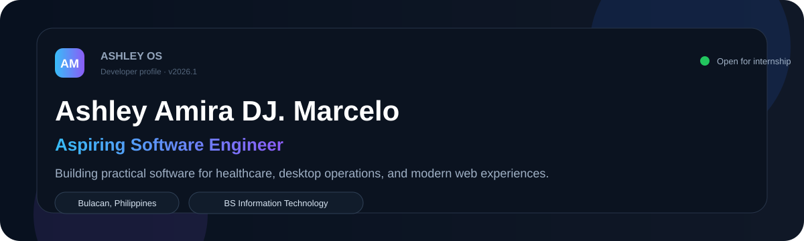
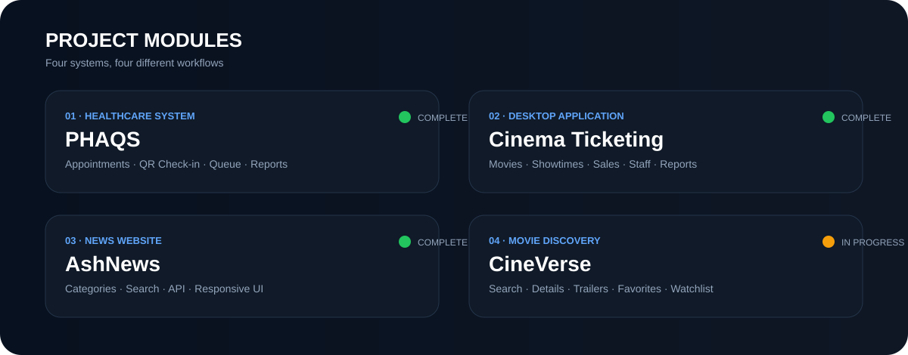
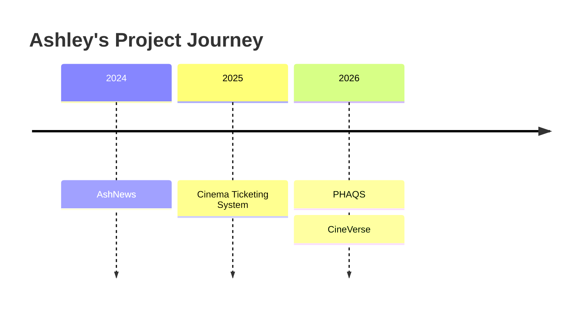

<div align="center">



<br>

[](mailto:ashleyamira04@gmail.com)
[](https://ph.linkedin.com/in/ashley-marcelo-79929040b)
[](https://github.com/ashleyamira422-code)


</div>

---

## `/profile`

```yaml
name: Ashley Amira DJ. Marcelo
role: Aspiring Software Engineer
education: BS Information Technology
school: College of Our Lady of Mercy
location: Bulacan, Philippines
focus:
  - Full-stack web systems
  - Desktop applications
  - UI/UX design
  - Database-driven software
```

I build practical software that improves real workflows. My experience includes healthcare appointment and queue management, cinema operations, responsive news platforms, movie discovery interfaces, authentication, database design, testing, and technical documentation.

---

## `/project-modules`



### `PHAQS`
**Pulilan Health Center Appointment and Queue System**

A full-stack capstone system for online appointment booking, QR-assisted check-in, live queue monitoring, RHU information, patient communication, reports, and administrative operations.

`PHP` `MySQL` `JavaScript` `Bootstrap` `Google OAuth` `Leaflet`

---

### `Cinema Ticketing System`
A C# Windows Forms and MySQL desktop application for managing movies, showtimes, ticket sales, staff records, revenue, and cinema reports.

`C#` `Windows Forms` `MySQL` `Visual Studio`

---

### `AshNews`
A responsive news website with categorized stories, search, clean article layouts, and API-driven content.

`HTML` `CSS` `JavaScript` `News API`

---

### `CineVerse`
A dark movie discovery website with search, movie details, trailer previews, favorites, and watchlist features.

`HTML` `CSS` `JavaScript` `Movie API`

---

## `/tech-stack`

### Frontend
<p>
  
</p>

### Backend & Database
<p>
  
</p>

### Desktop & Tools
<p>
  
</p>

---

## `/current-learning`

```text
Laravel
REST APIs
UI/UX Design
Software Architecture
Git Collaboration Workflow
```

---

## `/development-journey`



---

## `/github-analytics`

<div align="center">


<br>


</div>

> GitHub statistics may appear blank until repositories and commits are publicly available.

---

## `/goals`

- Build software that solves real-world problems.
- Improve my full-stack development workflow.
- Learn modern frameworks and software architecture.
- Contribute to collaborative development projects.
- Grow into a reliable software engineer.

---

## `/contact`

```text
Email    : ashleyamira04@gmail.com
GitHub   : github.com/ashleyamira422-code
LinkedIn : Ashley Marcelo
Portfolio: Coming Soon
```

<div align="center">

### Building practical software with purpose.

Designed by **Ashley Amira DJ. Marcelo**

</div>
